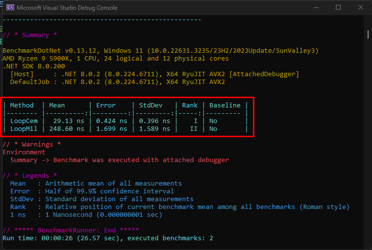

<h1 align="center">
   
  <b>Benchmark</b>
   
</h1>

<h4 align="center">Aplicação console para testes de benchmark</a>.</h4>

  <a href="#sobre">Sobre</a> •
  <a href="#informações-técnicas">Fundamentos</a> •
  <a href="#licença">Licença</a>

## **Sobre**

Aplicação simples com exemplos de uso da biblioteca de [BenchMarkDotnet](https://benchmarkdotnet.org/).

## **Informações Técnicas**

### **Fundamentos**

Aqui fica a lista das ferramentas, arquitetura e tecnologias utilizadas.

* C# 12
* .NET 8
* BenchmarkDotnet 0.13.12

### **Como Usar**

Para clonar e rodar essa aplicação, você precisará do [Git](https://git-scm.com) e o .NET 8 instalado em sua máquina.

Para rodar o benchmark você deve selecionar o modo release no visual studio.

# Referências

- https://benchmarkdotnet.org/